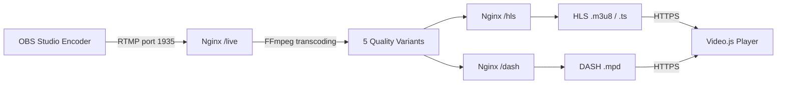

<div align="center">

# 📡 Secure HLS Adaptive Bitrate Streaming
### Nginx + RTMP + FFmpeg + SSL on Ubuntu 20.04

[](https://ubuntu.com/)
[](https://nginx.org/)
[](https://ffmpeg.org/)
[](https://developer.apple.com/streaming/)
[](https://letsencrypt.org/)
[](LICENSE)

**A complete guide to set up a secure multi-quality live streaming server with Adaptive Bitrate (ABR)**

دليل شامل لإعداد بث مباشر متعدد الجودات باستخدام Nginx + RTMP + FFmpeg مع شهادة SSL على Ubuntu 20.04

</div>

---

## 📖 Table of Contents

- [Overview](#-overview)
- [Features](#-features)
- [Requirements](#-requirements)
- [Architecture](#-architecture)
- [Installation Steps](#-installation-steps)
- [Testing](#-testing)
- [Troubleshooting](#-troubleshooting)
- [Contributing](#-contributing)
- [License](#-license)

---

## 🎯 Overview

This project provides a complete step-by-step guide to set up a secure live streaming server using **Nginx** with the **RTMP** module and **FFmpeg** on **Ubuntu 20.04**. The setup enables **Adaptive Bitrate Streaming (ABR)** with multiple quality levels.

**بالعربي:** يشرح هذا المشروع كيفية إعداد خادم بث مباشر آمن باستخدام Nginx مع وحدة RTMP وأداة FFmpeg، بحيث يبث الفيديو بعدة جودات مختلفة ويختار المشغّل تلقائياً الجودة المناسبة لسرعة اتصال المشاهد.

---

## ✨ Features

- ✅ **RTMP ingest** from OBS Studio and similar encoders
- ✅ **Automatic transcoding** to 5 quality levels (480p, 720p, 960p, 1280p, source)
- ✅ **HLS & DASH delivery** for cross-device compatibility
- ✅ **Free SSL certificate** from Let's Encrypt
- ✅ **Video.js web player** ready to use
- ✅ **Automatic recording** in FLV/MP4 format
- ✅ **Live statistics dashboard**
- ✅ **Optional AES-128 HLS encryption**

---

## 🛠 Requirements

| Requirement | Details |
|-------------|---------|
| OS | Ubuntu 20.04 LTS |
| CPU | 4 cores or more |
| RAM | 4 GB minimum |
| Storage | 20 GB available |
| Domain | Registered domain with A record pointing to server |
| Ports | 80, 443, 1935 open |

---

## 🏗 Architecture



### Output Qualities

| Suffix | Resolution | Bitrate | Target Audience |
|--------|------------|---------|-----------------|
| `_low` | 480p | 256 kbps | Mobile / Slow connection |
| `_mid` | 720p | 768 kbps | Medium connection |
| `_high` | 960p | 1024 kbps | Good connection |
| `_higher` | 1280p | 1920 kbps | HD - Fast internet |
| `_src` | Original | Source | Best possible quality |

---

## 🚀 Installation Steps

> ⚠️ Replace `YOURDOMAIN` with your actual domain (e.g., `stream.example.com`) in all commands below.

### 1. Server Preparation

Update the system:

```bash
sudo apt update && sudo apt upgrade -y
```

Install essential packages:

```bash
sudo apt-get install wget unzip software-properties-common dpkg-dev git \
  make gcc automake build-essential zlib1g-dev libpcre3 libpcre3-dev \
  libssl-dev libxslt1-dev libxml2-dev libgd-dev libgeoip-dev \
  libgoogle-perftools-dev libperl-dev pkg-config autotools-dev gpac \
  ffmpeg mediainfo mencoder lame libvorbisenc2 libvorbisfile3 \
  libx264-dev libvo-aacenc-dev libmp3lame-dev libopus-dev -y
```

### 2. Install Nginx & RTMP

```bash
sudo apt install nginx -y
sudo apt install libnginx-mod-rtmp python3-certbot-nginx -y
```

### 3. Create Directories

```bash
# Website folder
sudo mkdir -p /var/www/yourdomain/web/js/videojs

# Streaming folders
sudo mkdir -p /var/livestream/hls \
              /var/livestream/dash \
              /var/livestream/recordings \
              /var/livestream/keys

# Symbolic links
sudo ln -s /var/livestream/hls  /var/www/yourdomain/web/hls
sudo ln -s /var/livestream/dash /var/www/yourdomain/web/dash

# Set ownership
sudo chown -R www-data:www-data /var/livestream /var/www/yourdomain
```

Clone the nginx-rtmp-module:

```bash
cd /usr/src
sudo git clone https://github.com/arut/nginx-rtmp-module

sudo cp /usr/src/nginx-rtmp-module/stat.xsl /var/www/html/stat.xsl
sudo cp /usr/src/nginx-rtmp-module/stat.xsl /var/www/yourdomain/web/stat.xsl
```

### 4. Cross-domain Setup

```bash
sudo nano /var/www/html/crossdomain.xml
```

Paste this content:

```xml
<?xml version="1.0"?>
<!DOCTYPE cross-domain-policy SYSTEM
  "http://www.adobe.com/xml/dtds/cross-domain-policy.dtd">
<cross-domain-policy>
  <allow-access-from domain="*"/>
</cross-domain-policy>
```

Copy files:

```bash
sudo cp /var/www/html/crossdomain.xml /var/www/yourdomain/web/crossdomain.xml
sudo cp /var/www/html/index.nginx-debian.html /var/www/yourdomain/web/index.html
```

### 5. Basic Nginx Config

```bash
sudo nano /etc/nginx/sites-available/yourdomain.conf
```

<details>
<summary>📄 Click to view the full config</summary>

```nginx
server {
    listen 80;
    listen [::]:80;

    server_name YOURDOMAIN;
    root /var/www/YOURDOMAIN/web;

    index index.html index-nginx.html index.htm index.php;
    client_max_body_size 8192M;
    add_header Strict-Transport-Security "max-age=63072000;";
    add_header X-Frame-Options "DENY";

    location / {
        add_header Cache-Control no-cache;
        add_header Access-Control-Allow-Origin *;
        try_files $uri $uri/ =404;
    }

    location /crossdomain.xml {
        root /var/www/html;
        default_type text/xml;
        expires 24h;
    }

    location /control {
        rtmp_control all;
        add_header Access-Control-Allow-Origin * always;
    }

    location /stat {
        rtmp_stat all;
        rtmp_stat_stylesheet stat.xsl;
        # auth_basic Restricted Content;        # Create a valid .htpasswd before uncommenting this.
        # auth_basic_user_file .htpasswd;       # Create a valid .htpasswd before uncommenting this.
    }

    location /stat.xsl {
        root /var/www/YOURDOMAIN/web;
    }

    location ~ /\.ht {
        deny all;
    }

    location /hls {
        types {
            application/vnd.apple.mpegurl m3u8;
            video/mp2t ts;
        }
        autoindex on;
        alias /var/livestream/hls;

        expires -1;
        add_header Cache-Control no-cache;
        add_header 'Access-Control-Allow-Origin' '*' always;
        add_header 'Access-Control-Expose-Headers' 'Content-Length';

        if ($request_method = 'OPTIONS') {
            add_header 'Access-Control-Allow-Origin' '*';
            add_header 'Access-Control-Max-Age' 1728000;
            add_header 'Content-Type' 'text/plain charset=UTF-8';
            add_header 'Content-Length' 0;
            return 204;
        }
    }

    location /dash {
        types {
            application/dash+xml mpd;
            video/mp4 mp4;
        }
        autoindex on;
        alias /var/livestream/dash;

        expires -1;
        add_header Strict-Transport-Security "max-age=63072000";
        add_header Cache-Control no-cache;
        add_header 'Access-Control-Allow-Origin' '*' always;
        add_header 'Access-Control-Expose-Headers' 'Content-Length';

        if ($request_method = 'OPTIONS') {
            add_header 'Access-Control-Allow-Origin' '*';
            add_header 'Access-Control-Max-Age' 1728000;
            add_header 'Content-Type' 'text/plain charset=UTF-8';
            add_header 'Content-Length' 0;
            return 204;
        }
    }
}
```

</details>

Enable the site and test:

```bash
sudo ln -s /etc/nginx/sites-available/YOURDOMAIN.conf \
          /etc/nginx/sites-enabled/YOURDOMAIN.conf

sudo nginx -t
sudo systemctl restart nginx
```

### 6. SSL Certificate

```bash
sudo certbot --nginx -d YOURDOMAIN
```

> ⚠️ Make sure your domain has an A record pointing to your server IP before running this command.

### 7. Configure nginx.conf

Backup and download the ready-made config:

```bash
sudo mv /etc/nginx/nginx.conf /etc/nginx/nginx-original.conf

sudo wget -O /etc/nginx/nginx.conf \
  https://raw.githubusercontent.com/ustoopia/Nginx-config-for-livestreams-ABS-HLS-ffmpeg-transc-/main/etc/nginx/nginx.conf
```

<details>
<summary>📄 nginx.conf sections explained</summary>

- **`http {}`** - Basic Nginx settings (workers, gzip, logs)
- **`/live` application** - RTMP ingest point on port 1935
- **`/hls` application** - Produces `.m3u8` and `.ts` files
- **`/dash` application** - Produces MPEG-DASH (`.mpd`) files
- **`/recorder` application** - Auto-records streams

</details>

### 8. Install Video.js Player

```bash
sudo wget -O /var/www/YOURDOMAIN/web/js/videojs/latest.zip \
  https://github.com/videojs/video.js/releases/download/v7.11.4/video-js-7.11.4.zip

cd /var/www/YOURDOMAIN/web/js/videojs
sudo unzip latest.zip
```

Create `videoplayer.html`:

```html
<!DOCTYPE html>
<html>
<head>
    <meta charset="utf-8" />
    <title>Live Stream</title>
    <link href="https://YOURDOMAIN/js/videojs/video-js.css" rel="stylesheet">
</head>
<body>
<center>
    <video-js id="live_stream" class="vjs-default-skin" controls
              preload="auto" width="1280" height="auto">
        <source src="https://YOURDOMAIN/hls/stream/index.m3u8"
                type="application/x-mpegURL">
    </video-js>

    <script src="https://YOURDOMAIN/js/videojs/video.js"></script>
    <script src="https://YOURDOMAIN/js/videojs/videojs-http-streaming.js"></script>
    <script>
        var player = videojs('live_stream');
    </script>
</center>
</body>
</html>
```

Set permissions:

```bash
sudo chown -R www-data:www-data /var/www/yourdomain/web /var/www/html
```

### 9. Enable ABR

```bash
sudo nano /etc/nginx/nginx.conf
```

**Steps:**

1. Uncomment the `exec ffmpeg` lines that produce 5 quality variants
2. Comment out the line: `push rtmp://localhost/hls;`
3. Uncomment the 5 `hls_variant` lines inside the `hls` application
4. Save and restart:

```bash
sudo nginx -t
sudo systemctl restart nginx
```

Create `abs.html` for adaptive playback:

```html
<!DOCTYPE html>
<html>
<head>
    <meta charset="utf-8" />
    <title>Adaptive Live Stream</title>
    <link href="https://YOURDOMAIN/js/videojs/video-js.css" rel="stylesheet">
</head>
<body>
<center>
    <video-js id="live_stream" class="vjs-default-skin" controls
              preload="auto" width="1280" height="auto"
              poster="https://YOURDOMAIN/poster.jpg">
        <source src="https://YOURDOMAIN/hls/stream.m3u8"
                type="application/x-mpegURL">
    </video-js>

    <script src="https://YOURDOMAIN/js/videojs/video.js"></script>
    <script src="https://YOURDOMAIN/js/videojs/videojs-http-streaming.js"></script>
    <script>
        var player = videojs('live_stream');
    </script>
</center>
</body>
</html>
```

---

## 🎬 Testing

### OBS Studio Settings

| Option | Value |
|--------|-------|
| **Service** | Custom |
| **Server** | `rtmp://YOURDOMAIN/live` |
| **Stream Key** | `stream` |

Then open in your browser:

```
https://YOURDOMAIN/abs.html
```

### Statistics Dashboard

Monitor live streams at:

```
https://YOURDOMAIN/stat
```

---

## 🔧 Troubleshooting

<details>
<summary><strong>Stream not showing in browser</strong></summary>

Open port 1935:

```bash
sudo ufw allow 1935/tcp
sudo ufw reload
```

</details>

<details>
<summary><strong>Nginx config error</strong></summary>

Check error log:

```bash
sudo tail -f /var/log/nginx/error.log
```

</details>

<details>
<summary><strong>High CPU usage</strong></summary>

Reduce quality variants in `nginx.conf`, or use `-preset ultrafast` instead of `veryfast`.

</details>

<details>
<summary><strong>Stream delay / latency</strong></summary>

Reduce `hls_fragment` to `2s` and `hls_playlist_length` to `10s`.

</details>

---

## 🤝 Contributing

Contributions are welcome! Follow these steps:

1. **Fork** the repository
2. Create a new branch: `git checkout -b feature/AmazingFeature`
3. Commit your changes: `git commit -m 'Add some AmazingFeature'`
4. Push to the branch: `git push origin feature/AmazingFeature`
5. Open a **Pull Request**

---

## 📚 Useful References

- [nginx-rtmp-module documentation](https://github.com/arut/nginx-rtmp-module/wiki/Directives)
- [FFmpeg documentation](https://ffmpeg.org/documentation.html)
- [Video.js documentation](https://videojs.com/getting-started)
- [Let's Encrypt](https://letsencrypt.org/)

---

## 📄 License

This project is licensed under the **MIT License** - see the [LICENSE](LICENSE) file for details.

---

<div align="center">

**⭐ If you found this guide helpful, please give it a star! ⭐**

Made with ❤️ for the streaming community

</div>
